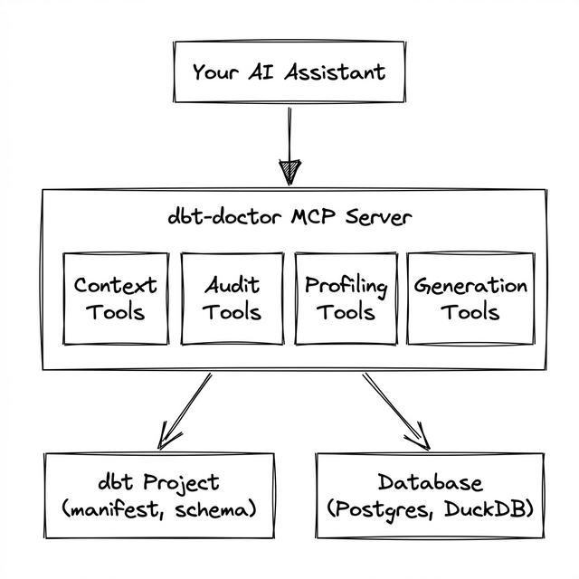

<p align="center">
  
</p>

<h1 align="center">🩺 dbt-doctor</h1>

<p align="center">
  <strong>AI-driven quality & governance MCP Server for dbt projects.</strong><br/>
  Audit coverage, profile data, detect schema drift, and auto-generate documentation — all through natural language with your AI assistant.
</p>

<p align="center">
  <a href="https://github.com/Astoriel/dbt-doctor/actions/workflows/ci.yml">
    
  </a>
  <a href="https://pypi.org/project/dbt-doctor/">
    
  </a>
  <a href="https://python.org">
    
  </a>
  <a href="LICENSE">
    
  </a>
  
</p>

---

## 🤔 What is dbt-doctor?

**dbt-doctor** is an [MCP (Model Context Protocol)](https://modelcontextprotocol.io) server that gives your AI coding assistant deep awareness of your dbt project's health. Instead of manually running CLI commands and reading outputs, you can simply ask your AI:

> *"What's the health of my dbt project?"*  
> *"Profile the fct_orders model and suggest tests for it."*  
> *"Auto-document the models with lowest test coverage."*

dbt-doctor handles all the heavy lifting — reading the manifest, profiling your warehouse, detecting schema drift, and writing back to schema.yml files — all without leaving your AI chat.

> 💡 **Designed to complement** the official [dbt-labs/dbt-mcp](https://github.com/dbt-labs/dbt-mcp), not replace it. dbt-labs/dbt-mcp runs dbt commands; dbt-doctor audits, profiles and documents.

---

## ✨ Key Features

### 🔍 Project Auditing
Score your project 0–100% across three dimensions — documentation, testing and naming conventions. Get a ranked list of worst-covered models to prioritize.

### 📊 Data Profiling  
Run efficient single-pass column statistics (NULL rate, cardinality, min/max, uniqueness) using one batched SQL query per table. No slow row-by-row scanning.

### 🔄 Schema Drift Detection
Compare what's in your warehouse right now against what your `manifest.json` says should be there. Spot added, removed and type-changed columns instantly.

### 🤖 Intelligent Test Suggestions
Translate profile statistics into concrete dbt test recommendations. A column that's 100% unique and non-null? → suggest `not_null` + `unique`. Low cardinality? → suggest `accepted_values` with the actual values pre-filled.

### ✍️ Non-Destructive YAML Writing
Update `schema.yml` files using `ruamel.yaml` to preserve your hand-written comments, existing tests and formatting. Only adds what's missing, never removes what you wrote.

### 🚀 End-to-End Doc Generation
One command to: profile a model → suggest tests → preview changes → write to schema.yml. The full loop from "undocumented" to "well-tested" in a single AI conversation turn.

---

## 🛠️ 12 MCP Tools

| Category | Tool | Description |
|---|---|---|
| **Context** | `list_models` | All models with doc/test coverage status |
| **Context** | `get_model_details` | Full model info: SQL, columns, lineage, tests |
| **Audit** | `audit_project` | Health score (0–100%), naming violations, worst models |
| **Audit** | `check_test_coverage` | Models ranked by test coverage |
| **Audit** | `analyze_dag` | Detect orphans, max depth, high fan-out nodes |
| **Audit** | `get_project_health` | **Entry point** — single-call dashboard |
| **Profiling** | `profile_model` | Batch column statistics: NULL%, unique%, min/max |
| **Profiling** | `execute_query` | Read-only SQL against your warehouse |
| **Profiling** | `detect_schema_drift` | Compare DB columns vs manifest definitions |
| **Generation** | `suggest_tests` | Profile stats → concrete dbt test list |
| **Generation** | `update_model_yaml` | Write docs & tests to schema.yml (safe merge) |
| **Generation** | `generate_model_docs` | **Killer feature**: E2E profile→suggest→write |

---

## ⚡ Quick Start

### Install

```bash
pip install dbt-doctor
```

### Configure Claude Desktop

Add to `claude_desktop_config.json`:

```json
{
  "mcpServers": {
    "dbt-doctor": {
      "command": "dbt-doctor",
      "args": ["--project-dir", "/absolute/path/to/your/dbt/project"]
    }
  }
}
```

### Configure Cursor

Add to `.cursor/mcp.json`:

```json
{
  "mcpServers": {
    "dbt-doctor": {
      "command": "dbt-doctor",
      "args": ["--project-dir", "/absolute/path/to/your/dbt/project"]
    }
  }
}
```

> **prerequisite:** Run `dbt compile` first to generate `target/manifest.json`. dbt-doctor reads this file to understand your project structure.

---

## 💬 Example AI Conversations

### Auto-document your worst model

```
You:   "Audit my dbt project and document the worst covered model"

AI  → get_project_health()
    ← Score: 38%. fct_orders has 0% column coverage and no tests.

AI  → generate_model_docs("fct_orders")
    ← Profiled 1.2M rows.
       order_id: 100% unique, 0% null → suggest not_null + unique
       status: 4 distinct values → suggest accepted_values: [placed, shipped, completed, returned]

AI  → update_model_yaml("fct_orders", description="...", columns=[...])
    ← ✅ Written to models/marts/_fct_orders.yml (added 6 tests, preserved 2 existing)
```

### Detect schema drift before a deploy

```
You:   "Check if fct_orders has any schema drift"

AI  → detect_schema_drift("fct_orders")
    ← ⚠️ DRIFT DETECTED:
       + discount_amount (DECIMAL) — in DB but not in manifest
       ~ total_amount: manifest says FLOAT, DB says DECIMAL(12,2)
```

### DAG health check

```
You:   "Are there any structural issues with my DAG?"

AI  → analyze_dag()
    ← ⚠️ 3 orphan models (no downstream dependencies)
       ⚠️ stg_base has 12 downstream models (high fan-out)
       ✅ Max chain depth: 5 (within recommended limits)
```

---

## 🏗️ Architecture

```
┌─────────────────────────────────────────────┐
│           Your AI Assistant                 │
│      (Claude / Cursor / Copilot Chat)       │
└──────────────────┬──────────────────────────┘
                   │  MCP Protocol
┌──────────────────▼──────────────────────────┐
│          dbt-doctor MCP Server              │
│                                             │
│  ┌─────────┐ ┌───────┐ ┌──────┐ ┌───────┐   │
│  │ Context │ │ Audit │ │ Prof │ │  Gen  │   │
│  └────┬────┘ └───┬───┘ └──┬───┘ └───┬───┘   │
│       └──────────┴────────┴─────────┘       │
│                   │                         │
│  ┌────────────────▼────────────────────┐    │
│  │           Core Layer                │    │
│  │  manifest.py  profiles.py  project  │    │
│  └────────────────┬────────────────────┘    │
└───────────────────┼─────────────────────────┘
          ┌─────────┴──────────┐
          ▼                    ▼
  ┌───────────────┐   ┌─────────────────┐
  │  dbt Project  │   │    Database     │
  │ manifest.json │   │  PostgreSQL /   │
  │ dbt_proj.yml  │   │  DuckDB         │
  │ schema/*.yml  │   │                 │
  └───────────────┘   └─────────────────┘
```

### Project Structure

```
src/dbt_doctor/
├── server.py                 # FastMCP entrypoint — 12 tools registered
│
├── core/                     # Read-only project parsing
│   ├── manifest.py           # manifest.json with mtime-based caching
│   ├── profiles.py           # profiles.yml with env_var() resolution
│   ├── project.py            # dbt_project.yml parser
│   └── schema_reader.py      # Finds and reads existing schema.yml
│
├── connectors/               # Database abstraction
│   ├── base.py               # Abstract BaseConnector (ABC)
│   ├── postgres.py           # psycopg v3, read-only enforcement
│   └── duckdb.py             # DuckDB, zero-config, used in tests
│
├── analyzers/                # All read-only analysis logic
│   ├── auditor.py            # Coverage scoring, naming violations
│   ├── dag_analyzer.py       # Orphan detection, depth, fan-out
│   ├── profiler.py           # Batched column statistics per table
│   └── drift_detector.py     # DB schema vs manifest comparison
│
├── generators/               # Write operations (with preview)
│   ├── test_suggester.py     # Rule-based test recommendations
│   ├── yaml_writer.py        # ruamel.yaml non-destructive merge
│   └── doc_generator.py      # E2E: profile → suggest → write
│
└── utils/
    └── sql_sanitizer.py      # Whitelist-based identifier validation
```

---

## 🧪 Testing

```bash
# Install dev dependencies
pip install -e ".[dev]"

# Run tests
pytest tests/ -v

# Run with coverage
pytest tests/ --cov=dbt_doctor --cov-report=term-missing
```

**Test results:**

```
tests/test_manifest_parser.py  ......... (9 tests)
tests/test_auditor.py          ......   (6 tests)
tests/test_dag_analyzer.py     ......   (6 tests)
tests/test_profiler.py         .......  (7 tests — DuckDB in-memory)
tests/test_test_suggester.py   ........  (8 tests)
tests/test_yaml_writer.py      ....     (4 tests)

====== 40 passed in 0.42s ======
```

---

## 🔒 Security Design

- **Read-only database access** — all `execute_query` calls are wrapped in a read-only transaction. Write operations are blocked at the connector level.
- **SQL injection prevention** — all table and column identifiers are validated against a strict whitelist regex before being interpolated into queries.
- **No credentials in memory** — profiles.yml credentials are fetched fresh each connection and not cached.
- **Preview before write** — `generate_model_docs` always shows a diff preview before applying changes to schema.yml. You can choose not to apply.

---

## 🗺️ Roadmap

- [ ] BigQuery connector
- [ ] Snowflake connector  
- [ ] Redshift connector
- [ ] `detect_schema_drift` batch mode (all models at once)
- [ ] Model-level `accepted_values` inference from warehouse data
- [ ] Slack/PagerDuty alerts on drift detection
- [ ] GitHub Actions integration for drift-as-CI

---

## 🔗 Related Projects

| Project | Type | Difference |
|---|---|---|
| [dbt-labs/dbt-mcp](https://github.com/dbt-labs/dbt-mcp) | MCP | Official dbt MCP — runs dbt commands, executes queries |
| [dbt-coverage](https://github.com/slidoapp/dbt-coverage) | CLI | Coverage only, no AI integration, no YAML writing |
| [dbt-project-evaluator](https://github.com/dbt-labs/dbt-project-evaluator) | dbt package | Requires install in each project, no profiling |

**dbt-doctor** is the only tool combining audit + profiling + drift detection + AI-driven YAML generation in a single MCP server.

---

## 📄 License

MIT — see [LICENSE](LICENSE).

---

<p align="center">Made with ❤️ for the dbt community</p>
